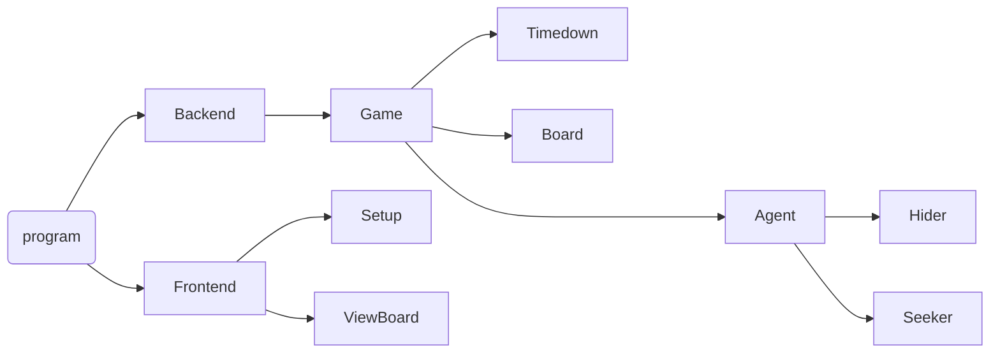

# VNU - HCMUS
# Course: Introduction to Artificial Intelligence
# Project 1: Hide and Seek
## I. Member info:

|No.|   ID     | Name          |
|---|---|---|
|1  |22127050|  Hồ Minh Đăng   |
|2  |22127202|  Võ Hùng Khoa   |
|3  |22127266|Nguyễn Bình Minh |
|4  |22127439|  Võ Hữu Tuấn    |

## II. Brief of project
### 0. Introduction:
There are some rules in the game you need to know carefully:
- The board is covered by wall.
- The walls and obstacles are placed perpendicular to the board, not oblique. We should not create a gap between two walls by placing two blocks together only at one vertex.
- Each agent takes up one cell in space.
- Agents can move in 8 directions (left, right, up, down, ...) but not move over or through objects.
- Each agent only moves to the next one cell at a time and it takes them one unit in distance. distance.
- In the beginning, agents know the map clearly such as the map size, their position on the map, wall position, and obstacles.
- The game is over if the seeker catches all hiders (win) or time out (lose). The seeker must touch the hiders if they want to catch them.
- The agent can observe within a certain range (for simple, in a square with a radius is 3 units). When there are walls/obstacles in this area, they will hide some cells from agents. 

Read more: [CTT303-Project01.pdf]
(https://courses.ctda.hcmus.edu.vn/pluginfile.php/132976/mod_resource/content/1/CTT303-Project01.pdf)
### 1. Main functions:

### 2. Level option:
- Level 1: There is only one hider and remain in place all time. Don’t limit time (maximum steps). 
- Level 2: There are many hiders and remain in place all time. The seeker knows the number of hiders. Don’t limit time. 
- Level 3: Hiders can be movable but they only observe in 2 units range. Each agent moves in turn. Don’t limit time. 
- Level 4: Hiders can move obstacles to other places before the game start (seeker do his task) and hiders cannot change them during the game is happening. Time is limited. The seeker can move obstacles. All obstacles are repositioned in valid operation.
